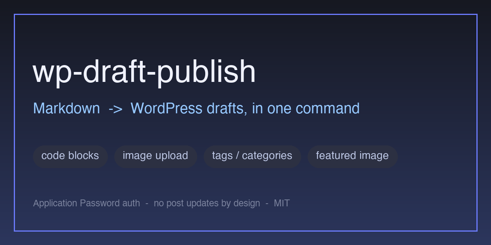
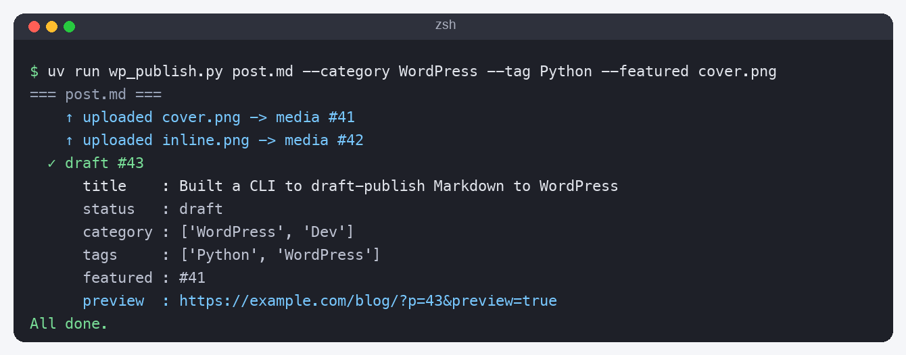

# wp-draft-publish

Publish Markdown / code files (and Obsidian notes) to **WordPress as drafts** — with proper
code blocks, image upload, tags/categories, and a featured image — in a single command.



Built for the "write in Obsidian/Markdown, push a draft to WordPress, tidy up later" workflow.
It does **not** update existing posts by design: if you want to change something, just publish again.

## Why

- WordPress with **two-factor authentication** blocks normal scripted logins. This tool uses a
  WordPress **Application Password** (HTTP Basic auth) which bypasses the login-screen 2FA.
- Code snippets come out as real WordPress code blocks (HTML-escaped, no broken `<` / `>` / `&`).
- Local images — both Markdown `` and Obsidian `![[file]]` embeds — are uploaded to the
  media library and turned into Gutenberg image blocks automatically.

## Features

- 📝 Markdown → WordPress (frontmatter, headings, lists, tables, blockquotes, code fences)
- 💻 Code-file mode: point at `main.py` / `app.ts` / `script.sh` and the whole file becomes one code block
- 🖼️ Image upload + insertion (`` and Obsidian `![[…]]`), de-duplicated per run
- 🏷️ Tags & categories by **name** (resolved if they exist, created if not)
- ⭐ Featured image (eyecatch)
- ✅ Prints a **preview URL** after posting so you can check the draft
- 🔌 No external services beyond your WordPress REST API

## Requirements

- Python 3.10+
- A self-hosted WordPress (5.6+) with the REST API enabled
- A WordPress **Application Password** (WP admin → *Users → Profile → Application Passwords*)

## Install

Using [uv](https://docs.astral.sh/uv/) (recommended — the script declares its own deps inline):

```bash
git clone https://github.com/xiaotiantakumi/wp-draft-publish.git
cd wp-draft-publish
uv run wp_publish.py --help          # deps auto-installed on first run
```

Or with pip:

```bash
pip install git+https://github.com/xiaotiantakumi/wp-draft-publish.git
wp-draft-publish --help
```

## Authentication

The tool reads three **environment variables**:

| Variable | Description |
|---|---|
| `WP_URL` | Base URL of the site. **Include the subdirectory** if WordPress lives in one (e.g. `https://example.com/blog`). |
| `WP_USERNAME` | Your WordPress login name |
| `WP_APP_PASSWORD` | An Application Password (spaces are stripped automatically) |

Provide them in **any one** of these ways:

**1. A `.env` file (easiest)** — copy the template and fill it in:

```bash
cp .env.example .env      # then edit .env  (it is git-ignored — never commit it)
uv run wp_publish.py note.md
```

Lookup order: `--env-file` → `./.env` → next to the script → its parent. Already-set environment
variables always win, so `.env` only fills in what's missing.

**2. Export in your shell:**

```bash
export WP_URL='https://example.com/blog' WP_USERNAME='you' WP_APP_PASSWORD='xxxx xxxx ...'
uv run wp_publish.py note.md
```

**3. A secret manager** — inject the same variables before the command (e.g. Vault, AWS/GCP secrets,
Azure Key Vault, [direnv](https://direnv.net/), …). Anything that sets the env vars works.

> ⚠️ **Most common mistake:** if your WordPress is in a subdirectory, `WP_URL` **must** include it
> (`…/blog`). The root `/wp-json/` can return 200 while only the subdirectory honors the Application
> Password — so a wrong base URL looks like a generic `401 rest_not_logged_in`. Sanity check:
> `GET {WP_URL}/wp-json/wp/v2/users/me` with Basic auth should return **200** and your user.

## Usage

```bash
# All *.md in a directory -> drafts (prints a preview URL for each)
uv run wp_publish.py ./notes/

# Recurse into subdirectories
uv run wp_publish.py -r ./vault/blog/

# A single note
uv run wp_publish.py post.md

# A code file -> one code block (language inferred from the extension)
uv run wp_publish.py main.py

# With tags, categories and a featured image
uv run wp_publish.py post.md --category Dev --category WordPress --tag Python --featured cover.png

# Render only, no posting (no credentials needed)
uv run wp_publish.py --dry-run post.md
```



### Options

| Option | Description |
|---|---|
| `-r, --recursive` | Recurse into subdirectories for a directory argument |
| `--status` | `draft` (default) / `publish` / `pending` / `private` |
| `--code-style` | `core` (default, Gutenberg code block) / `prism` (adds `language-` classes) |
| `--category NAME` | Category name (repeatable; created if missing) |
| `--tag NAME` | Tag name (repeatable; created if missing) |
| `--featured PATH` | Featured image (eyecatch) |
| `--featured-from-first` | Use the first inline image as the featured image |
| `--attachments-dir DIR` | Extra directory to resolve Obsidian images |
| `--lang` / `--title` / `--excerpt` / `--slug` | Code language / title / excerpt / slug overrides |
| `--env-file PATH` | Path to a `.env` file (real env vars take precedence) |
| `--no-verify` | Skip the post-publish fetch/report |
| `--dry-run` | Render & preview without posting |

### Front matter (Markdown)

```yaml
---
title: My Post              # else first "# heading" in the body, else the filename
categories: [Dev, WordPress]
tags: [Python, REST API]
featured: images/cover.png  # "cover" / "thumbnail" also accepted
excerpt: A short summary
slug: my-post
---
```

CLI `--category` / `--tag` are **added** on top of front matter.

### Images

- Markdown `` and Obsidian `![[file|alt]]` are both supported.
- Local images are uploaded to the media library and converted to `wp:image` blocks (with the media id).
- The same file is uploaded only once per run (reused for both inline use and the featured image).
- `http(s)://` and `data:` URLs are left untouched. Resolution order: absolute → `--attachments-dir`
  → next to the Markdown file → recursive search by filename.

### Tags & categories

Passed by name and resolved against your site. Existing terms are reused; missing ones are created.
List your current taxonomy to pick good names:

```bash
uv run python - <<'PY'
import os, requests
b, a = os.environ["WP_URL"].rstrip("/"), (os.environ["WP_USERNAME"], os.environ["WP_APP_PASSWORD"].replace(" ", ""))
for tax in ("categories", "tags"):
    r = requests.get(f"{b}/wp-json/wp/v2/{tax}", auth=a, params={"per_page": 100, "orderby": "count", "order": "desc"})
    print(f"== {tax} =="); [print(x["count"], x["name"]) for x in r.json()[:50]]
PY
```

### Verifying drafts

After posting, the tool fetches the draft back and prints title / status / category / tags / featured
and a **preview URL** (`{WP_URL}/?p={id}&preview=true`). Open it while logged in to review the draft.

## Troubleshooting

- **`401 rest_not_logged_in`** — first suspect the base URL (`WP_URL` must include the subdirectory,
  see above). If that's correct, some Apache + FastCGI hosts drop the `Authorization` header; add to
  the WordPress root `.htaccess`:
  ```apache
  <IfModule mod_rewrite.c>
  RewriteEngine On
  RewriteCond %{HTTP:Authorization} ^(.+)$
  RewriteRule ^ - [E=HTTP_AUTHORIZATION:%1]
  </IfModule>
  SetEnvIf Authorization "(.*)" HTTP_AUTHORIZATION=$1
  ```
- **`403` / blocked** — a WAF may flag POSTs that contain code. Temporarily relax the relevant rule.
- Workflow tip: `--dry-run` → one file → a whole directory.

## How it works

`POST {WP_URL}/wp-json/wp/v2/posts` with HTTP Basic auth (username + Application Password). Markdown
is rendered with [Python-Markdown](https://python-markdown.github.io/); code fences become Gutenberg
`wp:code` blocks; images are uploaded via `…/wp/v2/media`; tags/categories via `…/wp/v2/tags|categories`.

## License

MIT © Takumi Oda
